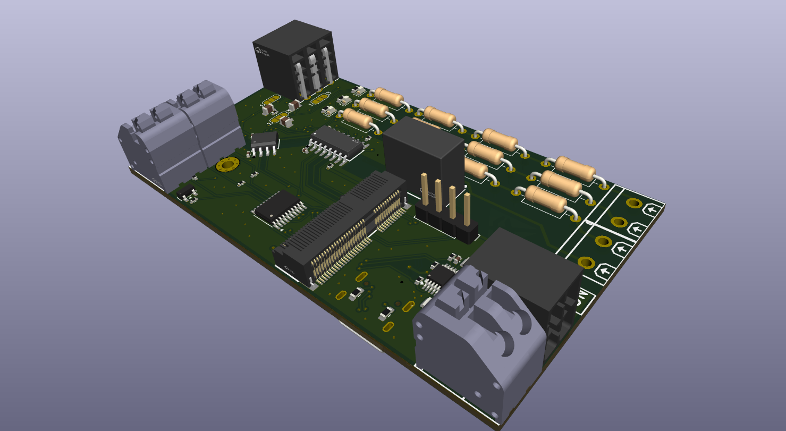
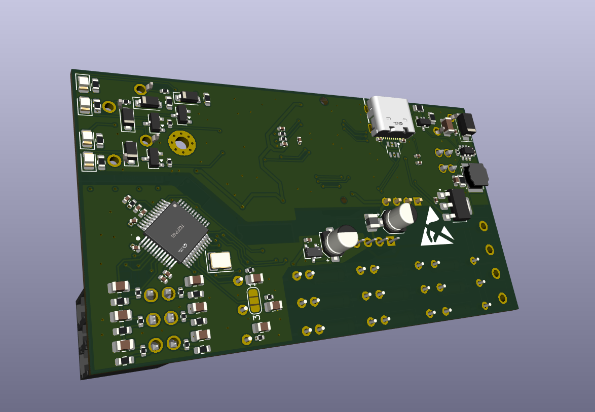

# RA5 2022 M — Placa Base (Raptor)

Placa base/carrier de um CLP (Controlador Lógico Programável) modular: um
front-end de I/O que não tem MCU principal próprio — os periféricos de
sensoriamento e medição são controlados por um cartão MCU+modem LTE plugado
no soquete M.2 Key-E (`J1`, visível nas fotos), seguindo o padrão mecânico
M.2 mas com pinagem própria (3.3V nativo, sem relação com um cartão M.2 real).

Principais blocos presentes na placa:

- **Alimentação**: entrada via módulo `B0303S-1W`, buck `TPS54202DDC`,
  regulador linear `AMS1117-3.3` (trilho USB) e conector USB-C de
  passthrough para flash/debug do cartão MCU.
- **2x entradas analógicas 4-20mA** (diferenciais) via ADC `ADS1115`.
- **2x entradas e 2x saídas digitais** condicionadas por opto/divisor e
  transistor, respectivamente.
- **Medidor de energia trifásico `ATM90E32AS`**, em domínio galvanicamente
  isolado (`GND2`/`VDD2`) do resto da placa.
- **MCU de housekeeping `STM8S003F3P`**, fazendo a ponte I2C dos sinais de
  I/O digital.
- Terminais parafusáveis `KF250-3.5-2P-2` para os laços de corrente e
  demais conexões de campo.

## Renders da placa finalizada

*Vista geral do lado dos componentes: soquete M.2 (`J1`), USB-C, terminais
parafusáveis e conectores de campo nas laterais.*

*Vista girada ~180°, mostrando o mesmo lado a partir do ângulo oposto.*
